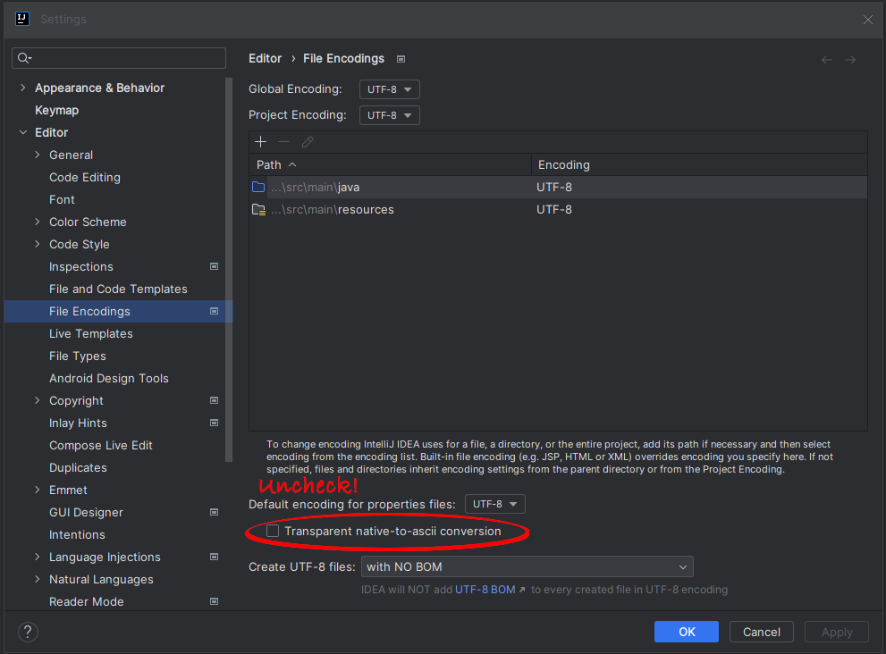

# Why an i18n Demo?
I was developing a Spring Boot application that needed to support multiple languages.
This was my first Thymeleaf project to support multiple languages.
I followed multiple tutorials and read the Thymeleaf documentation, but still I was getting the dreaded black diamond 
with a question mark instead of the UTF-8 characters. It turns out that when I switched to IntelliJ I didn't change the 
default character encoding to UTF-8. What's strange is that I had checked the encoding of the various files in Notepad++, 
and they were all encoded as UTF-8. I'm still a little puzzled as to why the IDE showed the UTF-8 characters correctly while
I typed, but then didn't render them. Furthermore, why should the IDE impact the way the application works when launched 
with java -jar? Since IntelliJ is, by all other accounts, a fine product, I'm sure there's a good explanation, but I haven't 
found it yet. I decided to create this demo to help others who may be in the same situation.

 
_Changes to Settings_

<b>VERY Important Note:</b> Be sure to un-check the "Transparent native-to-ascii conversion" box. If you don't, you'll get Unicode mark-up inserted in your text.

_Why not just accept the character encoding of the underlying files?< /rant>_

# Getting Started

## Clone me
Feel free to clone this project and do what you want with it. I hope it helps you.
## Recreate me
If you want to recreate this project, here's how I did it.
* Create a new Spring Boot project using the Spring Initializr. 
  * I used Java 17, Maven, Spring Boot Actuator, and Thymeleaf.
  * I didn't modify the pom at all for this demo.
* Create a basic controller and index.html template.
* Create a @Configuration class and be sure it implements WebMvcConfigurer.
  * add a @Bean method to return a LocaleResolver.
  * add a @Bean method to return a MessageSource.
  * add a @Bean method to return a LocaleChangeInterceptor.
  * add an @Override method to add the interceptor to the registry.
* Create a messages.properties file in the resources folder for each language you want to support.

